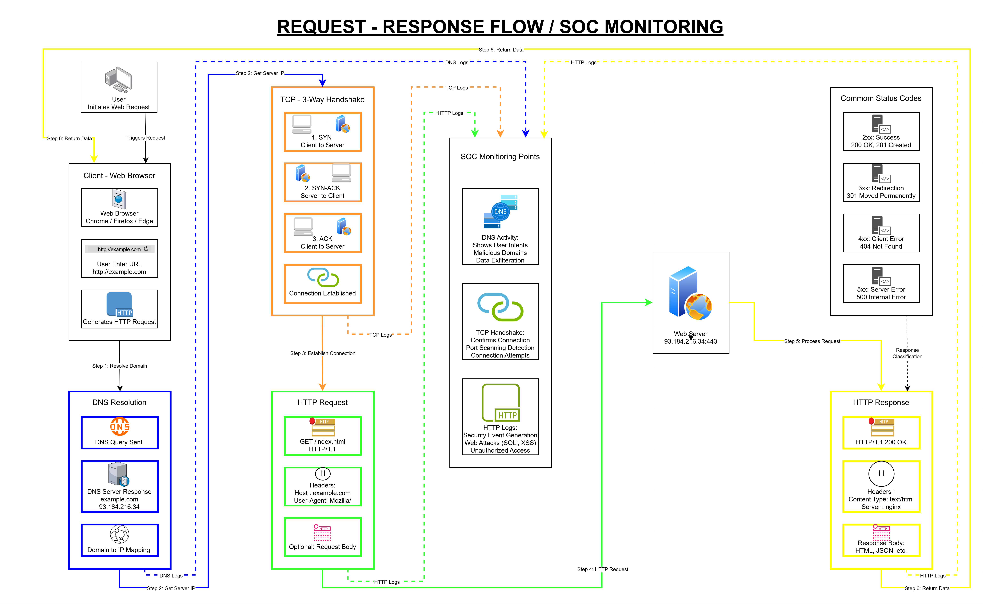

# Web Request–Response Flow

## Core Concept
The web request–response flow describes what happens when a user visits a website.
A client (browser) requests a resource, and a server processes that request and returns a response.
This flow is the foundation of web communication and security monitoring.

---
## Diagram
This diagram illustrates how a web request travels from the client to the server and back.
DNS resolves the destination, TCP establishes the connection, and HTTP handles the request and response.
SOC teams monitor each stage to detect malicious intent, abnormal connections, and web-based attacks.

---
## Step-by-Step Request–Response Flow

### 1. User Action (Trigger)
The process begins when a user types a URL into a browser or clicks a link.
The browser prepares to fetch the requested webpage.

---

### 2. Client (Web Browser)
The browser understands the requested domain name but does not know the server’s IP address.
Before sending any web request, it must resolve the destination.

---

### 3. DNS Resolution (Finding the Server)
The browser sends a DNS query asking for the IP address of the domain.
The DNS server replies with the corresponding IP address.

This step reveals **where the client intends to connect**.

---

### 4. TCP Three-Way Handshake (Establishing Connection)
The client and server establish a reliable connection using:
- SYN
- SYN-ACK
- ACK

This step confirms that communication is possible.
No application data is exchanged yet.

---

### 5. HTTP Request (Client to Server)
Once the connection is established, the browser sends an HTTP request containing:
- Request method (GET, POST, etc.)
- Headers (browser type, content type, cookies)
- Optional body (form data or credentials)

This is the actual request for a resource.

---

### 6. Server Processing
The server:
- Checks permissions
- Processes the request
- Retrieves data or application content
- Prepares an HTTP response

---

### 7. HTTP Response (Server to Client)
The server sends a response that includes:
- Status code (e.g., 200, 403, 404, 500)
- Headers
- Response body (HTML, data, error message)

---

## Common HTTP Status Codes
- **200 OK** – Request successful
- **403 Forbidden** – Access denied
- **404 Not Found** – Resource does not exist
- **500 Internal Server Error** – Server-side failure

---

## SOC Monitoring Points

### DNS Monitoring (Intent)
SOC analysts observe which domains are being resolved.
Suspicious or malicious domain lookups often indicate early attack stages.

---

### TCP Connection Monitoring (Connection)
Connections to unusual IP addresses or ports can indicate scanning, command-and-control traffic, or misuse.

---

### HTTP Log Monitoring (Action)
HTTP logs reveal:
- Brute-force attempts
- SQL injection
- Unauthorized access
- Data exfiltration

Most web-based attacks occur at this stage.

---

## SOC Relevance
Understanding the request–response flow helps SOC analysts:
- Correlate DNS, network, and web logs
- Identify attack stages
- Detect abnormal behavior early
- Understand how user actions translate into security events

Every web request leaves traces across multiple logging layers.
SOC visibility depends on connecting those traces into a single incident.

